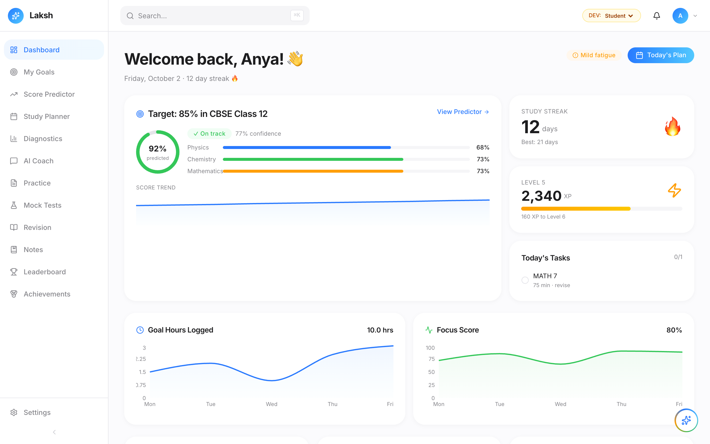

# Laksh

Laksh is an AI study platform for CBSE Class 12 board exam prep.
Students set a target score, take adaptive diagnostics, and get a personalised daily study plan, practice questions, and an AI coach.
Parents and teachers get their own dashboards to follow progress and predicted scores.



## Getting started

```bash
npm install
npm run dev
```

Open [http://localhost:3000](http://localhost:3000). Without Supabase env vars set, the app runs on local seed data.

Built with Next.js, Supabase, and Claude.
